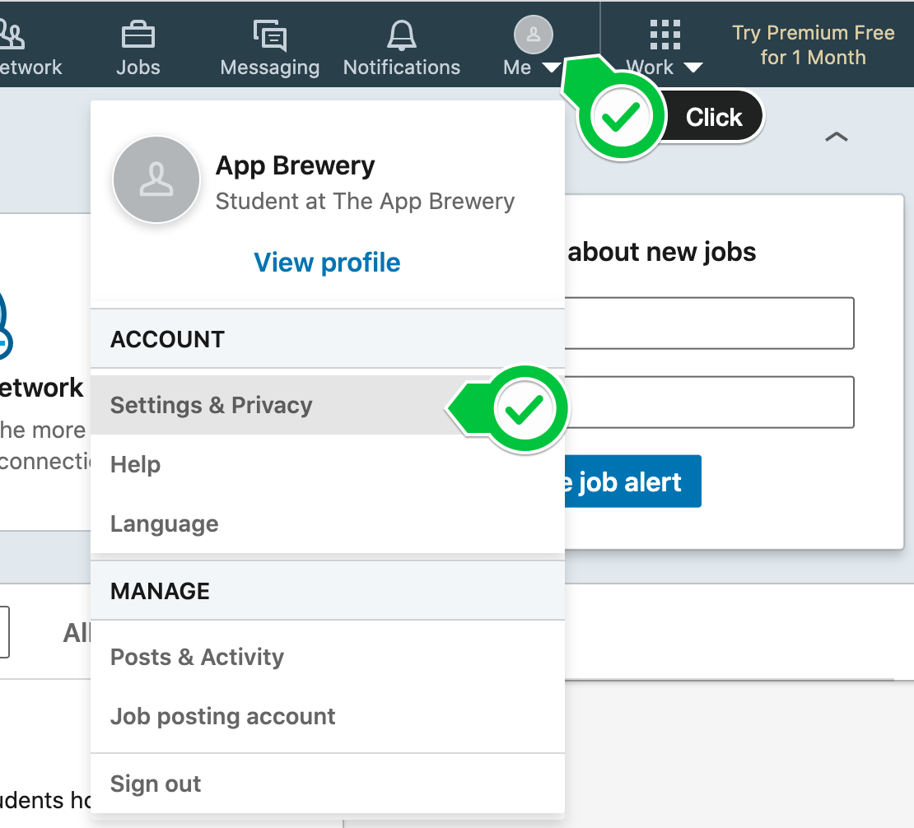
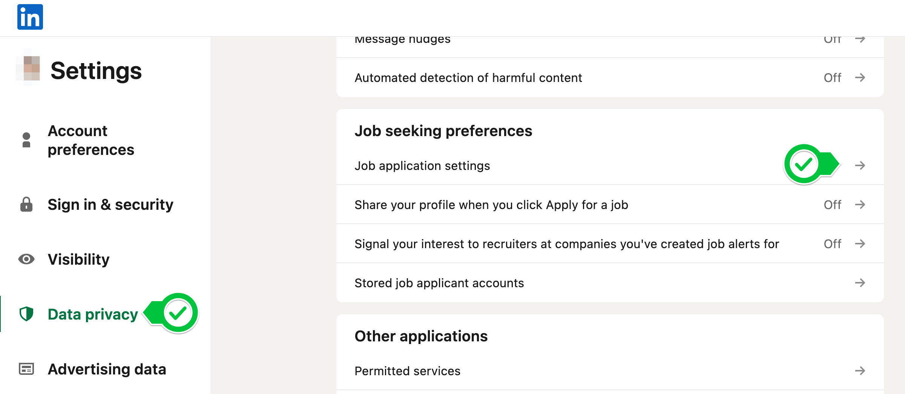
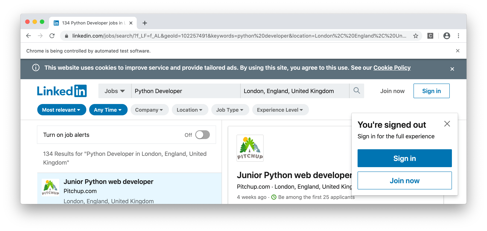
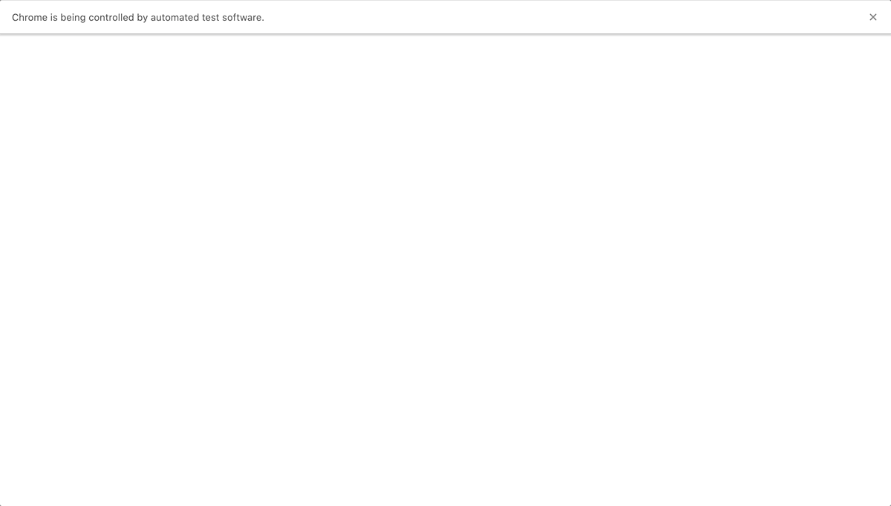
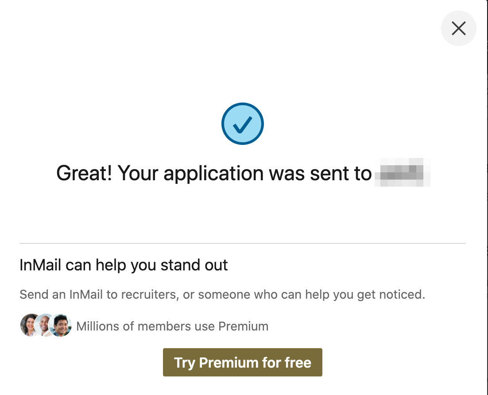
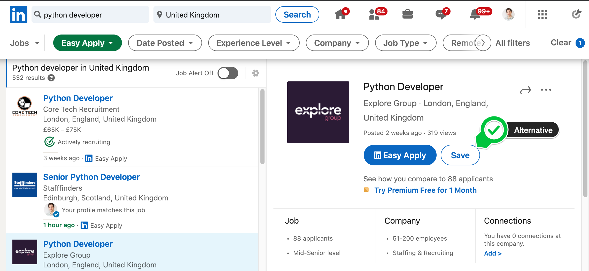
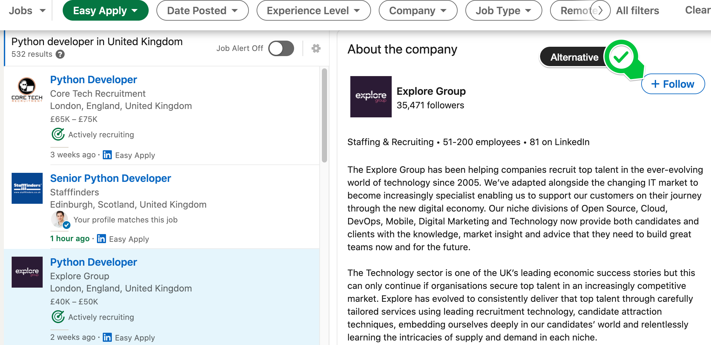
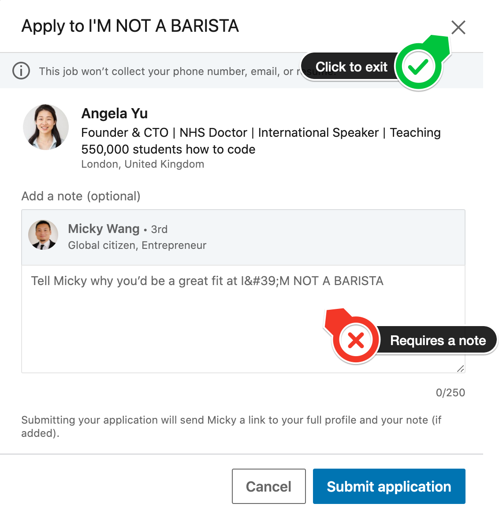
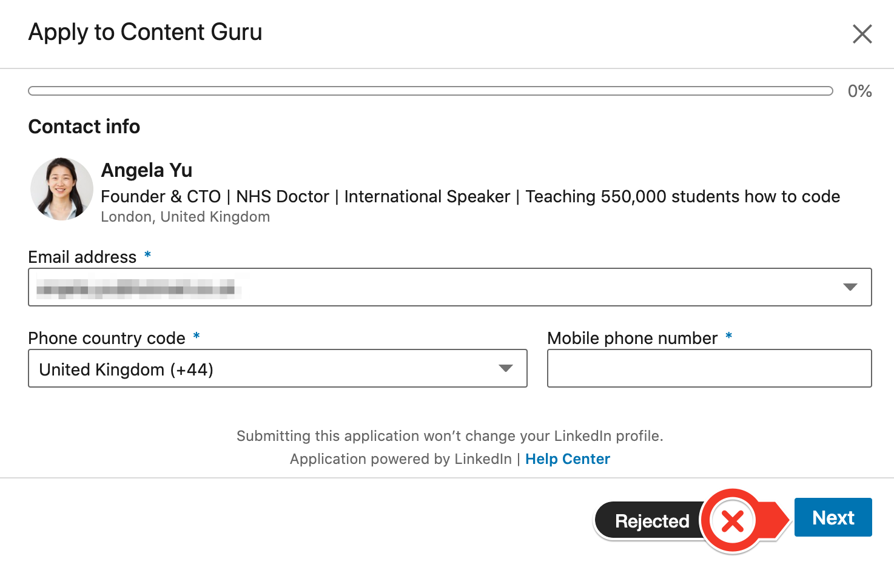

## Step 1 - Setup Your LinkedIn Account
Project Objective
The goal of today's project is to learn to use Selenium to automate applying for jobs. Thus, by the end of today, you should have a program that can use LinkedIn's "Easy Apply" function to send applications to all the jobs that meet your criteria (instead of just a single listing).

If you have any reservations about sending job applications to the job listings on LinkedIn, an alternative is to "Save" all the jobs that meet your criteria and follow the company that posted the job instead.


Pro Tip: set up a new email account
The next couple of projects use sites like LinkedIn, Facebook, Tinder, Instagram, and Twitter. I recommend setting up a separate email address to use now, for example, your_name.100daysofcode@gmail.com. That way, you can use this separate email address for all the projects and create fresh accounts on all the sites that we mention in this course.


Sign up to LinkedIn and Configure your Profile
We'll be using LinkedIn to apply for jobs automatically, so you'll need to set up your profile and account on the website before we get started. (Consider creating a new LinkedIn account for the purpose of this exercise).

### 1. Make sure you've signed up to LinkedIn.com and save your email and password somewhere for later use.

NOTE: Do not enable 2-factor authentication/phone number verification while we are using Selenium. If you don't want to use your primary account for this project, feel free to set up a new LinkedIn account.

### 2. Companies who look at your application will look through your LinkedIn profile to see if you have the skills and necessary work experience. If you are serious about applying for jobs make sure you update your LinkedIn Profile.

### 3. Upload your resume by going to:

Me -> Settings & Privacy -> Data privacy -> Job seeking preferences -> Job application settings








## Step 2 - Automatically Login
### 1. Go to the Jobs tab and search for the job that you are interested in e.g. "Python developer". Add the "Easy Apply" filter and specify your desired location. e.g.


### 2. Copy the URL at the top of the address bar, it should contain all your requirements. e.g.

https://www.linkedin.com/jobs/search/?f_LF=f_AL&geoId=102257491&keywords=python%20developer&location=London%2C%20England%2C%20United%20Kingdom&redirect=false&position=1&pageNum=0

### 3. Using the URL and what you know about Selenium, try to open the page by using the webdriver. This is what you're aiming to see when you run your code:


### 4. Figure out how to automatically log in to LinkedIn using Selenium. This is what you're aiming to see when you run your code:


HINT: You might want to use sleep() to wait for page loads.








## Step 3 - Apply for a Job
### 1. Use Selenium to automatically apply to the first job that only requires you to enter your phone number. e.g.


If successful, you should see:



NOTE: Occasionally, LinkedIn will show you a Captcha when you log in, which you will need to complete manually.

If you are seeing "This job is no longer accepting applications", or if the first job has a multi-step application process, try changing the job search to a different search term e.g. "marketing" or "web development". We'll address this issue by skipping over these jobs in the next step.


What if I don't want to send an application right now?
If you're not comfortable sending applications to the job listings, I recommend adapting the project to save (all) the job(s) and follow the company that posted the listing(s) instead.



After all, the primary goal of the project is to get more practice programming and using Selenium



## Step 4 - Apply for all the jobs
Now that we've verified that we can automatically apply to a job, the next step to apply to all the jobs on the page!

There's a couple of things that we're going to ignore to make it easier:

### 1. We're only going to apply to the standard, 1-step applications e.g.


### 2. We're going to ignore the applications that require a note, e.g.




### 3. We're going to ignore the complex, multi-step applications, e.g.



Using what you've learnt (and some creativity/Googling) figure out how to get your Selenium bot to apply to all the jobs on the page. Clicking on each job on the left hand side in-turn and applying to each one automatically.

HINT: Selenium has a custom exception that gets raised when an element cannot be found it's called NoSuchElementException

You'll need to import it to use it:

```
from selenium.common.exceptions import NoSuchElementException
```
